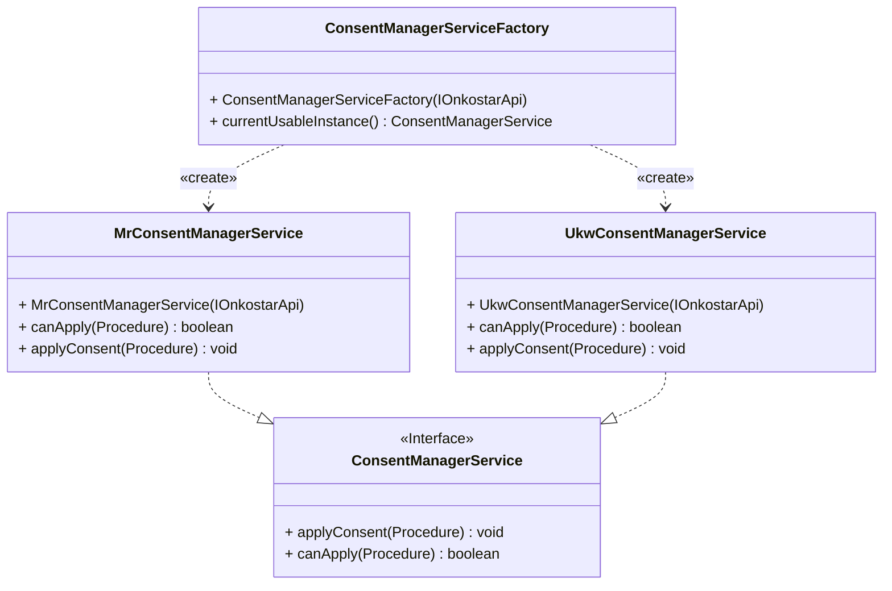
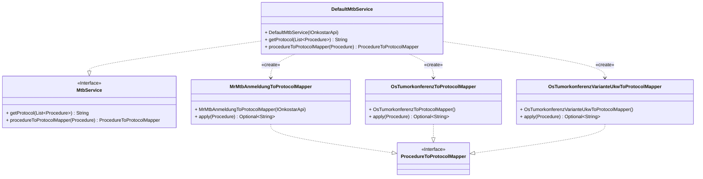

# Onkostar-Plugin zur Verwendung mit der DNPM-Formularsammlung

Die Formulare befinden sich im Verzeichnis [`/forms`](/forms) und liegen hier in gekürzter und sortierter Fassung einer OSC-Datei vor.

Zum Erstellen einer neuen Version der enthaltenen Datei(en) bitte den folgenden Befehl verwenden:

```shell
osc-variant modify --sorted --strip --output dnpm-formulare.osc <QUELLDATEI> 
```

Die für die Formulare verwendeten Formularscripte sind zudem im Verzeichnis [`/scripts``](/scripts) hinterlegt und können dort eingesehen werden.  

## Voraussetzungen

Dieses Plugin ist zur Verwendung mit Onkostar Version 2.14.0 oder neuer vorgesehen.

## Konfiguration

Dieses Plugin erlaubt die Konfiguration über Onkostar-Einstellungen.
Hierzu gibt es die Konfigurationsparameter:

* `consentform`: Zu verwendendes Consent-Formular
* `systemtherapieform`: Zu verwendendes Formular für die systemische Therapie.
* `mehrere_mtb_in_mtbepisode`: Angabe, ob mehrere MTBs je MTB-Episode verwendet werden.

## ATC-Codes

Dieses Plugin integriert eine Liste mit ATC-Codes mit Stand 2025.

### Hinweis für Updates

Die Liste kann aus dem Repository von DNPM:DIP heruntergeladen und automatisch angepasst werden.
Bei Bedarf das Jahr `2025` in unten stehenden Script austauschen.

Quelle der ATC-Code-Liste: https://github.com/dnpm-dip/atc-catalog.
Das Projekt ist unter der [MIT-Lizenz](https://github.com/dnpm-dip/atc-catalog/blob/main/LICENSE)
durch das Universitätsklinikum Tübingen und [@lucienclin](https://github.com/lucienclin) veröffentlicht worden.

```
curl \
  https://raw.githubusercontent.com/dnpm-dip/atc-catalog/refs/heads/main/catalogs_packaged/src/main/resources/ATC_2025.csv \
  | sed '/^\s*$/d' | sed 's/\t\t/\t/g' | sed 's/^/2025\t/g' | sed '0,/2025/{s/2025/Version/}' > src/main/resources/atc.csv
```


## DNPM-Consent (Veraltet)

*Achtung!* Dieser Teil ist veraltet und wird durch den allgemeinen MV-Consent abgelöst.

Das Plugin ist auf die Übernahme des DNPM-Consents ausgelegt. Hierzu muss die Einstellung `consentform` festgelegt werden.
Diese Einstellung muss manuell in der Datenbank angelegt werden und kann danach in Onkostar verändert werden.

```
INSERT INTO einstellung (name, wert, kategorie, beschreibung)
VALUES (
 'consentform',
 'MR.Consent',
 'DNPM',
 'Zu verwendendes Consent-Formular'
);
```

Aktuell werden folgende Consent-Formulare unterstützt:

* `MR.Consent`
* `Excel-Formular` (UKW - beinhaltet Consent-Angaben)



Eine Übernahme von Consent-Daten aus unbekannten Formularen ist nur manuell möglich.

## Therapieplan

### Mehrere MTBs in Therapieplan (Veraltet - nicht mehr unterstützt!)

**Achtung!** Dies wird nun nicht mehr angewendet. Es werden immer das Datum und der Verweis auf das MTB des Hauptformulars verwendet.
Zu den Gründen, siehe auch: https://github.com/pcvolkmer/onkostar-plugin-dnpm/issues/211#issuecomment-3498119327

**Im Zweifelsfall ist die Dokumentation entsprechend anzupassen, zumindest zu prüfen!**

Soll das automatische Befüllen des MTB-Datums Datum der Unterformulare *Einzelempfehlung* und *Rebiopsie* nicht durchgeführt werden, weil es mehrere MTBs je MTB-Episode gibt, so muss die Einstellung `mehrere_mtb_in_mtbepisode` vorhanden sein und auf den Wert `true` gesetzt sein.

```
INSERT INTO einstellung (name, wert, kategorie, optionen, beschreibung)
VALUES (
 'mehrere_mtb_in_mtbepisode',
 'false',
 'DNPM',
 '[{"key": "true", "value": "Ja"},{"key": "false", "value": "Nein"}]',
 'Angabe, ob mehrere MTBs je MTB-Episode verwendet werden.'
);
```

### Mapping MTB zu Therapieplan-Protokollauszug

Das Plugin ermöglicht die Übernahme von Inhalten aus einem MTB in den Protokollauszug des DNPM Therapieplans. Für die Formulare

* `OS.Tumorkonferenz`
* `OS.Tumorkonferenz.VarianteUKW`
* `MR.MTB_Anmeldung`

liegen bereits Implementierungen vor. Um eigene Implementierungen vorzunehmen, die sich an andere Formulare oder Formularvarianten richtet,
muss hierzu das Interface `ProcedureToProtocolMapper` implementiert werden. Dazu muss die Methode `apply(Procedure)` derart implementiert werden,
sodass aus einer Prozedur ein entsprechender Abschnitt als Text für den Protokollauszug gewandelt wird.

Als Rückgabewert wird hierbei ein Wert vom Typ `Optional<String>` erwartet, dabei z.B. `Optional.of("Text")`, wenn ein zu verwendender Text oder
z.B. `Optional.empty()` wenn kein zu verwendender Text zurückgegeben wird.

Anschließend ist das Mapping in `DefaultMtbService` in der Methode `procedureToProtocolMapper(Procedure)` einzutragen, beispielsweise durch

```
...
    case "Custom.Neuekonferenz":
        return new CustomNeuekonferenzToProtocolMapper();
...
```



Idealerweise werden entsprechende UnitTests hinzugefügt.

### Mapping Systemtherapie-Formular zu Prozedurwerten

Das Formular `DNPM KlinikAnamnese` verwendet eine Backend-Service-Funktion zum Ermitteln vorliegender Therapielinien. Für die Formulare

* `OS.Systemische Therapie`
* `OS.Systemische Therapie.VarianteUKW`

wird analog zum Mapping MTB auf Therapieplan-Protokollauszug eine formularspezifische Entscheidung getroffen, welcher Mapper zur
Laufzeit verwendet werden soll. Der Mapper muss hierbei das Interface `ProzedurToProzedurwerteMapper` implementieren.

In der Klasse `DefaultSystemtherapieService` wird zur Laufzeit der erforderliche Mapper für das verwendete Formular ausgewählt.

An dieser Stelle kann auch eine eigene Implementierung - eine neue Klasse, die das Interface `ProzedurToProzedurwerteMapper` implementiert -
integriert werden, indem das zu verwendende Formular (Formularname) und die zu verwendende Mapping-Klasse für den Formularnamen angegeben wird.

Hierbei kann in der Einstellung `systemtherapieform` festgelegt werden, dass ein anderes Formular als "OS.
Systemische Therapie" verwendet werden soll.
Diese Einstellung muss manuell in der Datenbank angelegt werden und kann danach in Onkostar verändert werden.

```
INSERT INTO einstellung (name, wert, kategorie, beschreibung)
VALUES (
 'systemtherapieform',
 'OS.Systemische Therapie',
 'System',
 'Zu verwendendes Formular für die systemische Therapie'
);
```

## Berechtigungsprüfung

Dieses Plugin unterstützt eine Berechtigungsprüfung anhand von personenstammbasierten als auch formularbasierten Berechtigungen.

Mögliche Berechtigungsanforderungen sind sowohl für die `PermissionEvaluator`en, als auch die Annotationen:

* `PermissionType.READ`
* `PermissionType.READ_WRITE`

### Prüfung der Berechtigung mithilfe eines Permission Evaluators

Zur Prüfung der Berechtigung können die implementierten `PermissionEvaluator`en einzeln als auch gemeinsam genutzt werden:

* `PersonPoolBasedPermissionEvaluator`: Berechtigungsprüfung basierend auf dem zugehörigen Personenstamm
* `FormBasedPermissionEvaluator`: Berechtigungsprüfung basierend auf dem zugehörigen Formular
* `DelegatingDataBasedPermissionEvaluator`: Berechtigungsprüfung basierend auf allen implementierten Evaluatoren

#### Beispiel der Anwendung

Das folgende Beispiel zeigt die Nutzung des `DelegatingDataBasedPermissionEvaluator`s zur Prüfung,
ob der aufrufende Benutzer Zugriff auf die Prozedur hat und gibt nur bei vorhandener Berechtigung
den Namen des Formulars zu dieser prozedur zurück.

```java
import dev.dnpm.oshelper.security.DelegatingDataBasedPermissionEvaluator;
import de.itc.onkostar.api.IOnkostarApi;

class DemoAnalyzer implements IProcedureAnalyzer {

    private final DelegatingDataBasedPermissionEvaluator permissionEvaluator;

    private final IOnkostarApi onkostarApi;

    public DemoAnalyzer(
            DelegatingDataBasedPermissionEvaluator permissionEvaluator,
            IOnkostarApi onkostarApi
    ) {
        this.permissionEvaluator = permissionEvaluator;
        this.onkostarApi = onkostarApi;
    }

    // ... übliche Methoden für einen Analyzer

    // Beispiel: Gib Formularname zurück, wenn Prozedur mit ID existiert
    // und der aufrufende Benutzer lesenden Zugriff auf diese Prozedur hat.
    // Dabei: Zugriff auf Prozedur anhand Personenstamm und Formulartyp
    public String getFormName(Map<String, Object> input) {
        var procedureId = AnalyzerUtils.getRequiredId(input, "id");

        if (procedureId.isEmpty()) {
            return "";
        }

        var procedure = onkostarApi.getProcedure(procedureId.get());

        if (
                null != procedure
                        && permissionEvaluator.hasPermission(
                        SecurityContextHolder.getContext().getAuthentication(),
                        procedure,
                        PermissionType.READ
                )
        ) {
            return procedure.getFormName();
        }

        return "";
    }

}
```

### Prüfung der Berechtigung und Absicherung von Methodenaufrufen

Zusätzlich zur Prüfung mit einem Permisison Evaluator sind, basierend auf Spring AOP, folgende Annotationen verfügbar:

* `FormSecured`: Berechtigungsprüfung wird für alle Argumente vom Typ `Procedure` anhand der Berechtigung auf das zugehörige Formular durchgeführt und erlaubt immer Zugriff auf Argumente vom Typ `Patient`
* `FormSecuredResult`: Berechtigungsprüfung wird für Rückgabewerte vom Typ `Procedure` anhand der Berechtigung auf das zugehörige Formular durchgeführt und erlaubt immer Zugriff auf Rückgabewerte vom Typ `Patient`
* `PersonPoolSecured`: Berechtigungsprüfung wird für alle Argumente vom Typ `Procedure` und `Procedure` anhand des zugehörigen Personenstamms durchgeführt.
* `PersonPoolSecuredResult`: Berechtigungsprüfung wird für Rückgabewerte vom Typ `Procedure` und `Procedure` anhand des zugehörigen Personenstamms durchgeführt.

#### Beispiel für Anwendung

Analog dazu eine Implementierung einer Service-Klasse, hier mit Spring-Annotation `@Service`.

Wird die Methode `getFormName(Procedure)` aufgerufen und der Benutzer hat keinen lesenden Zugriff auf die übergebene
Prozedur, wird eine Exception geworfen.

```java
import dev.dnpm.oshelper.security.FormSecured;
import dev.dnpm.oshelper.security.PermissionType;
import dev.dnpm.oshelper.security.PersonPoolSecured;

@Service
class DemoService {

    @FormSecured(PermissionType.READ)
    @PersonPoolSecured(PermissionType.READ)
    public String getFormName(Procedure procedure) {
        return procedure.getFormName();
    }

}
```

Der Aufruf im Analyzer kann nun wie folgt aussehen:

```java

import dev.dnpm.oshelper.security.IllegalSecuredObjectAccessException;

class DemoAnalyzer implements IProcedureAnalyzer {

    private final DemoService service;

    public DemoAnalyzer(
            DemoService demoService
    ) {
        this.demoService = demoService;
    }

    // ... übliche Methoden für einen Analyzer

    // Beispiel: Gib Formularname zurück, wenn Prozedur mit ID existiert
    // und der aufrufende Benutzer lesenden Zugriff auf diese Prozedur hat.
    // Dabei: Zugriff auf Prozedur anhand Personenstamm und Formulartyp
    public String getFormName(Map<String, Object> input) {
        var procedureId = AnalyzerUtils.getRequiredId(input, "id");

        if (procedureId.isEmpty()) {
            return "";
        }

        var procedure = onkostarApi.getProcedure(procedureId.get());

        if (null != procedure) {
            try {
                return demoService.getFormName(procedure);
            } catch (IllegalSecuredObjectAccessException e) {
                // Keine Berechtigung gegeben.
                // Durch die Annotationen wird eine berechtigungsprüfung vorgenommen,
                // schlägt diese fehl, wird eine IllegalSecuredObjectAccessException geworfen.
                // In diesem Fall wird hier eine leere Zeichenkette als Rückgabewert zurückgegeben.
                return "";
            }
        }

        return "";
    }

}
```

## Bauen des Plugins

Für das Bauen des Plugins ist zwingend JDK in Version 11 erforderlich.
Spätere Versionen des JDK beinhalten einige Methoden nicht mehr, die von Onkostar und dort benutzten Libraries verwendet
werden.

Voraussetzung ist das Kopieren der Datei `onkostar-api-2.14.0.jar` (oder neuer) in das Projektverzeichnis `libs`.

**_Hinweis_**: Bei Verwendung einer neueren Version der Onkostar-API oder des ATC-Codes-Plugins
muss die Datei `pom.xml` entsprechend angepasst werden.

Danach Ausführen des Befehls:

```shell
./mvnw package
```

## Testen des Plugins und Code-Voverage

Die Entwicklung des Plugins erfolgt mit automatisierten Tests. Diese können zusammen mit einem Bericht über die Testabdeckung
durch Ausführung des Befehls

```shell
./mvnw clean verify
```

ausgeführt werden.

Treten Fehler auf, so wird dies angezeigt. Einen Bericht über die Testabdeckung finden Sie als HTML-Seite unter
`target/site/jacoco/index.html`.
